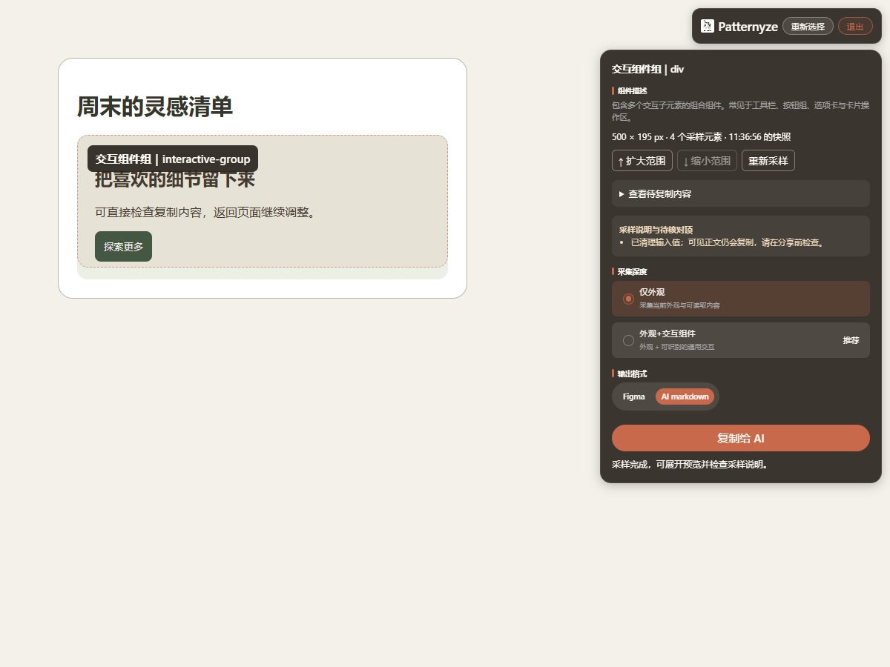
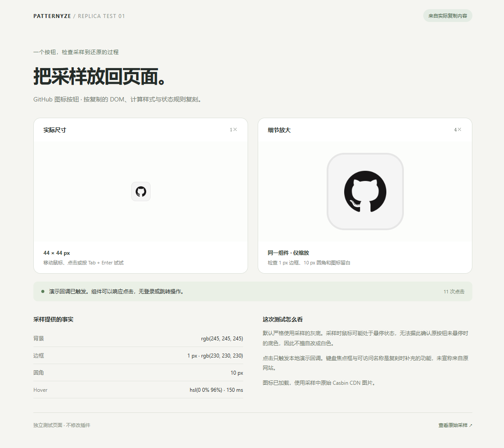

# Patternyze 1.0.1

天才Agent工程师的前端助手工具。

支持组件采样、多选、问题反馈、截图标注，以及控制台错误和网络请求记录。

[下载安装包](https://github.com/BBBQL2021/Patternyze/releases/download/v1.0.1/Patternyze-1.0.1.zip) · [版本说明](https://github.com/BBBQL2021/Patternyze/releases/tag/v1.0.1) · [安装](#安装) · [使用教程](#使用教程) · [复刻实例](#复刻实例) · [常见问题](#常见问题)



*图 1：在本地测试页面中运行的真实插件面板。橙色虚线标出选区，右侧用于检查和复制；此图不是浏览器安装页截图。*

## 安装

1. 下载上方 **Patternyze-1.0.1.zip**，先解压到一个长期保留的文件夹。普通使用不需要安装 Node.js。
2. 在浏览器地址栏输入 `chrome://extensions`（Chrome）或 `edge://extensions`（Edge），打开扩展管理页。
3. 开启 **开发者模式**，点击 **加载已解压的扩展程序**，选择直接包含 `manifest.json` 的文件夹，不要选择 ZIP 文件或它的上一级目录。
4. 确认扩展列表出现 **Patternyze 1.0.1**，再从浏览器工具栏的扩展菜单中将它固定，方便随时点击。
5. 打开普通 HTTP/HTTPS 网页，等待页面加载，点击 Patternyze 图标。看到浮动品牌条和 **选择控件** 按钮即已启动。

> 更新已有本地安装：在扩展管理页对 Patternyze 点击“重新加载”，随后刷新要采样的网页，再点击插件图标。

## 使用教程

### 第一步：选择需要的组件

点击 **选择控件**，将鼠标移到按钮、卡片或表单区域。高亮框覆盖目标后，点击一次固定选区。

对照图 1：先检查左侧虚线范围，再检查右侧组件名称、尺寸和元素数量。只选中了图标或文字时，用 **↑ 扩大范围** 纳入外层按钮或卡片；范围过大时，用 **↓ 缩小范围** 返回上一次范围。缩小操作用于撤回扩大操作，不是任意向下选择子节点；换另一个组件请点击 **重新选择**。

### 第二步：检查快照与采集深度

展开 **查看待复制内容**，检查文字、结构与样式，再阅读 **采样说明与待核对项**。如果出现内容截断、资源不可读或交互推断提示，应缩小范围或在复制后人工核对。

| 选项 | 适用场景 | 采集内容 |
| --- | --- | --- |
| 仅外观 | 复刻静态按钮、卡片、排版；输出到 Figma | 当前外观与可读取内容 |
| 外观+交互组件 | 请 AI 复刻按钮状态、菜单等通用交互 | 外观及可识别的通用交互，部分行为属于推断 |

采样后如果网页内容或状态变了，点击 **重新采样** 更新快照。切换标签页可以保留选区；如果原组件已被页面替换，则需要重新选择。插件不提取原站登录、支付、数据接口等业务逻辑。

### 附带来源链接

**附带来源链接**使用滑动开关，默认开启（当前页面会话内保留选择）。AI Markdown 的复制预览会显示页面标题、来源链接与采样时间，实际复制内容与预览一致。取消勾选后会移除额外的来源信息；组件本身的可见文字、图片资源地址仍按原采样规则保留。

来源链接只保留 HTTP/HTTPS 协议、域名与路径，移除账号密码、查询参数和 `#` 片段。路径和页面标题仍可能包含个人信息，请在分享前检查。链接跟随采样快照保存；网页地址变化后点击“重新采样”更新。Figma 模式禁用此选项并说明不附带来源链接，切回 AI Markdown 保留之前的选择。

复制内容以“组件采样”为标题，只附带采样资料，不再预设目标位置、默认新建项目或强制增量添加。添加、替换或独立复刻由你在对话中指定。预览区支持折叠、键盘滚动和长链接换行。

### 第三步 A：复制给 AI，添加到自己的项目

1. 选择 **AI markdown**，按需选择采集深度。
2. 展开预览，确认没有不想分享的可见正文或资源，然后点击 **复制给 AI**。
3. 等待面板提示已复制 Markdown，切换到支持代码生成的 AI 工具，粘贴完整内容。
4. 明确目标页面、项目技术栈和真实业务行为。可以在粘贴内容前加上以下要求：

```text
请根据下方 Patternyze 采样内容，在我的 React 项目的 src/pages/Home.tsx
中添加这个组件，放在现有标题下方。保留页面已有内容与样式。
优先还原尺寸、间距、字体、颜色、圆角和可确认的状态。
点击事件先连接本地演示回调，不访问原网站的业务接口。
完成后说明哪些效果已还原、哪些资源或交互仍需我补充。

（在这里粘贴完整的 Patternyze 采样内容）
```

5. 在自己的项目运行结果，分别检查默认、悬停、键盘聚焦和点击状态。视觉相似不代表业务功能已经接好。

### 第三步 B：复制到 Figma，继续编辑视觉稿

1. 选择 **Figma**；采集深度会切换为 **仅外观**。
2. 点击 **复制到Figma**，保持当前标签页，等待转换完成。面板会展示加载转换器、读取图片、处理字体和写入剪贴板等阶段。
3. 成功提示出现后，切换到 Figma 设计文件，在可编辑画布中粘贴：Windows 使用 `Ctrl+V`，macOS 使用 `Command+V`。
4. 核对图层、尺寸、字体、图片和背景；资源限制可能导致差异。Figma 模式下的预览只是结构摘要，最终图层在转换时读取组件当前外观。

> Figma 路径已有基础转换测试，但尚未完成真实 Figma 粘贴的端到端验收。若粘贴失败，先查看插件错误信息，也可改用 AI Markdown 输出。

### 取消、重试与退出

转换时可点击 **取消复制**。尚未写入剪贴板的结果会丢弃，选区保留；已经开始写入的剪贴板操作不可撤销。取消也不会立刻强制停止底层计算。转换中切换标签页会取消尚未写入的任务。

失败时可根据错误提示调整选区、重新采样，再点击 **重试复制**。完成后按 `Esc` 或点击 **退出** 关闭面板。

| 操作 | 快捷键或按钮 |
| --- | --- |
| 启动选择 | Windows：`Alt+Shift+C`；macOS：`Command+Shift+C` |
| 扩大选区 / 撤回扩大 | `↑` / `↓`，或右侧对应按钮 |
| 换一个组件 | 重新选择 |
| 更新选中组件快照 | 重新采样 |
| 退出 | `Esc` 或退出按钮 |

快捷键被占用时，可在浏览器扩展快捷键设置中修改；在输入控件中编辑时，方向键优先用于输入操作。

## 复刻实例

下图是根据一次真实复制内容制作的独立演示页面：左侧按实际尺寸呈现 GitHub 图标按钮，右侧放大 4 倍，方便检查边框、圆角和图标比例。



*图 2：用户提供的复刻效果截图。它展示网页复刻结果，不是 Figma 导入结果，也不代表插件会自动生成整张演示页面。*

| 核对项 | 这次样例的事实 |
| --- | --- |
| 按钮尺寸 | 44 × 44 px |
| 背景 | `rgb(245, 245, 245)` |
| 边框 | 1 px，`rgb(230, 230, 230)` |
| 圆角 | 10 px |
| Hover | `hsl(0 0% 96%)`，150 ms |
| 点击行为 | 本地演示回调；截图显示已触发 11 次，不包含原站登录或跳转 |

复刻时保留采样记录的灰底；采样可能发生在悬停状态，不能据此推断原按钮未悬停时一定是白底。演示页的键盘焦点框与可访问名称属于复刻时补充的功能，应与原始采样事实区分。

## 多选组件

在顶部工具条打开“多选”滑动开关，点击组件追加，再点已选组件取消。也可用 Shift + 点击快速追加。页面用编号高亮选区，面板显示已选列表，支持单独移除与清空。点击“完成选择”后可正常操作网页，点击“继续选择”再追加。最多 10 个组件；已包含在父级中的子组件不会重复采集，选中父级会合并已选子组件。

AI Markdown 按编号分别导出各组件（每个组件最多 300 个元素、10 层深度）。问题反馈的一份描述可关联多个编号区域。截图为当前可见区域标出相同编号，屏幕外选区不会出现在该截图中；重新选择或移除后建议重拍。Figma 目前只支持单选，多选会切到 AI Markdown。取消多选保留当前组件。

## 问题反馈

选中问题区域后，在面板顶部切换到 **问题反馈**，填写必填的问题描述，以及可选的期望效果、复现步骤，点击 **反馈给天才潇洒的开发**。开发可将反馈粘贴给 Codex，结合代码仓库定位修复。

默认包含来源信息、元素名称、附近标题、视口与滚动位置、CSS 选择器、元素和父级的稳定测试标记及精简 DOM（最多 4000 字符）；需要排查视觉问题时开启“附带详细样式”。这些是运行时定位线索，不是已确认的源码文件路径。可在项目中添加 data-testid 或 data-component 帮助定位。

切换选区与模式会保留填写内容，未复制就退出会显示悬浮确认小卡片（支持继续填写或退出），不使用浏览器原生确认框；问题反馈复制成功后会显示小礼花和成功提示；草稿只保留在当前页面内存，刷新或关闭网页会丢失。来源链接与可见正文分享前请检查。现在支持现场截图、红框标注、控制台错误与网络请求记录：

1. 选中问题区域，进入“问题反馈”，填写问题描述。
2. 点击“开始记录”，在网页上操作并复现问题，然后点击“停止记录”。同站点刷新可继续记录；刷新后需重新点击插件并选择区域，填写内容与截图不会跨刷新保存。离开原站点、关闭标签页或达到 5 分钟上限会停止记录。
3. 点击“截图 / 重拍”，检查自动标出的选区，点击截图打开大图编辑器，可添加文字、自动递增序号、箭头、矩形、圆形和线条（最多 100 条）。颜色支持取色器及色相滑块，线宽支持 1–20 px 滑动调整，字号 14–72 px，画布缩放 50%–250%。编辑器默认使用“拖动”模式：拖动空白处平移画布，拖动已有文字、序号或图形边缘移动标注，支持撤销；拖动模式下双击已有文字也可编辑。选择文字工具后，双击图片弹出文本框，可直接输入多行文字；双击已有文字可修改，Ctrl+Enter 确认，Esc 取消输入。滚轮以鼠标所在位置为中心缩放，“适应宽度”恢复视图；形状拖动绘制。样式应用于下一条标注。支持撤销、清空、保存或取消；Esc 取消本次编辑。保存后同步到预览、PNG 下载和完整反馈 JSON。截图只针对当前可见区域，会隐藏插件面板，最长边最多 2400 px；改变选区或页面后请重拍。
4. 展开“查看诊断记录”和“查看待复制内容”检查。默认最多保留 100 条错误/警告及 100 条请求，超限会提示。
5. “反馈给天才潇洒的开发”复制文字与诊断记录，图片请另行发送；推荐“下载完整反馈（含截图）”，将 JSON 文件直接交给开发/Codex，内含 Markdown、诊断记录、PNG 数据和标注坐标。也可单独下载标注截图。

新增 debugger 权限用于主动记录及截图，浏览器可能显示调试提示；其他调试工具占用、企业策略限制会提示失败。只收集 error/warn/assert、运行时异常及请求的清理后 URL、方法、状态、耗时与失败原因，不读取请求头、请求体、响应正文。URL 查询参数与片段被移除，错误文字进行常见令牌/邮箱脱敏，但仍需检查可见正文、路径和业务信息。页面独立的跨域框架、Worker 和开启前的日志不保证覆盖。诊断数据只在扩展内存中保存，停止后可清空，浏览器重启可能丢失。

开发可让 Codex：读取 JSON 的 markdown 和 diagnostics；将 screenshot.pngDataUrl 解码为 PNG 查看，结合截图和定位标记在当前仓库查找组件。测试过实际浏览器的调试事件、HTTP 500、截图标注和 JSON 下载；测试页面仅使用虚构数据，测试清单中的 localhost 权限只用于绕过工具栏激活步骤，发行清单没有新增 host_permissions。

## 常见问题

| 遇到的问题 | 建议处理 |
| --- | --- |
| 加载扩展提示找不到 manifest | 先解压，再选择直接包含 `manifest.json` 的目录 |
| 点击图标没有面板 | 先在普通网页重试；浏览器设置页、扩展管理页等受限页面不能像普通网页一样注入。更新后刷新原网页 |
| 只选中一小块 / 一次选中太多 | 用扩大、缩小范围调整；要换子组件时重新选择 |
| 内容已达到上限 | 将大区块分成多个组件分别采样；Markdown 上限为 300 个元素、10 层深度 |
| 网页变化了，输出还是旧内容 | 点击重新采样；组件被替换时重新选择 |
| 图片缺失、字体与原网页不同 | 查看采样说明，核对资源访问和字体回退；换较小组件重试，或在目标项目手动补齐 |
| 复制失败 / Figma 粘贴无结果 | 查看错误提示并重试，确认已出现成功提示后再粘贴；必要时改用 AI Markdown |
| 外观相似，但点击不能完成原站功能 | 插件不复制原站业务接口和事件处理器，需要在自己的项目连接回调与数据 |


## 1.0.1 更新

- 新增多选组件、问题反馈、现场诊断与截图标注。
- 标注支持默认拖动模式、滚轮缩放、文字双击编辑，以及颜色和线宽设置。
- 反馈复制成功展示礼花，退出确认使用悬浮卡片。
- 新增 debugger 权限，用于主动启动的现场记录与截图。

## 首版基础与改进

### 使用体验完善

- 可展开查看实际待复制的 Markdown；Figma 模式显示采样结构摘要，不将摘要宣称为最终图层预览。
- 展示尺寸、采样元素数量和快照时间，新增扩大/缩小范围、重新采样按钮。
- 面板展示内容截断、不可读 iframe、动态状态、推断交互、资源待核对与实际字体回退提示。
- 切换标签页保留选区及快照；页面替换组件时提示重新选择。网页内容变化后可点击“重新采样”更新快照。
- 转换显示加载转换器、读取图片、处理字体及写入剪贴板阶段，不使用虚假的百分比。
- 转换失败后保留选区，提供重试；取消后丢弃结果。取消会等待正在进行的转换结束，尚不强制中止计算；剪贴板写入开始后不可撤销。转换中切换标签页会取消尚未写入的任务。
- 面板适配窄窗口，状态消息支持屏幕阅读器播报；不向外部服务存储采样历史；现场记录新增 debugger 权限。

以下为首版基础修复：

- 名称统一为 Patternyze，版本为 1.0.1。
- 工具栏、扩展管理和浮动品牌图标均采用用户提供的图 1，完整保留画面及文字，等比例缩放并补白。
- 图标尺寸：16、32、48、128、1024 px；浮动品牌资源为 256 px。
- 修复 DOM/CSS 对齐与兄弟节点覆盖、动效数据丢失、选区外状态误判、文本域默认内容残留、采样数量限制、嵌套交互漏采、滚动高亮偏移、HTTP 图片占位替代。
- 补充 HTTP 页面复制备用路径、复制按钮防重复点击、转换器加载复用、输入控件方向键保护和窗口尺寸变化后的高亮更新。
- 无法读取的图片返回明确失败，不再静默以空白占位。Figma 路径也排除 textarea 默认文本子节点。

## 功能边界

采集不读取原站事件处理器或还原原站业务接口。Markdown 上限为 300 个元素、10 层深度，达到限制会标记截断。跨域 iframe、封闭 Shadow DOM、浏览器受限页面不能保证采样。跨域字体和图片受页面访问规则限制，字体可能回退。Figma 支持 URL 背景图嵌入，但复杂的多层背景混合、重复和自定义位置仍需检查粘贴后的效果。

清理输入值不等于自动识别所有个人信息；可见正文、资源、标签等仍会成为采样内容，请在分享前检查。

本地回归涵盖 DOM 行为、导出颜色、同源 iframe、剪贴板备用路径的数据路由、UI 选择、基础 Figma 转换和图片加载器。剪贴板与扩展 API 使用测试替身，不代表已经通过真实安装/权限/系统剪贴板/Figma 粘贴的端到端验收。

## 开发验证

需要 Node.js 20 或更新版本。

```sh
npm install
npx playwright install chromium
npm run check
npm test
```

可选设置 CHROME_EXECUTABLE 指向本机 Chrome；PLAYWRIGHT_MODULE 可指定现有 Playwright 模块路径。测试结果写入 tests/ 下，测试使用虚构数据和模拟剪贴板，不操作系统剪贴板。

插件直接运行根目录 JS 文件，无需构建。安装包只包含 manifest.json、content.js、service-worker.js、diagnostics-worker.js、figit.js、icons/、docs/ 和 README.md。单独下载源代码也可通过开发者模式加载根目录。

## 第三方素材与转换器

figit.js 是已有第三方转换器 bundle，完整上游构建来源和依赖锁定仍待补齐。当前图标采用用户提供的图案，含第三方品牌元素；本仓库未对这些素材作重新授权声明，也未为整个项目指定开源许可证。
